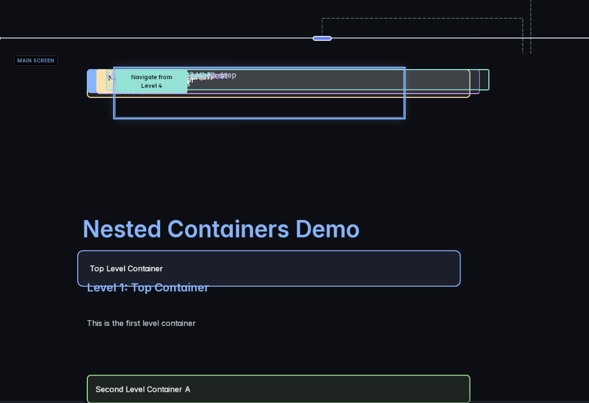

# Tree View POC Plan
## Simple, Focused Proof of Concept

## Current Problem

- Big nested rectangles (matryoshka doll effect)
- Can't see structure clearly
- Hard to select nested items
- Not intuitive

## POC Goal
**Show blocks as a file-system-style tree on the infinite canvas**
- Import HUML → Renders as tree layout
- Collapsible tree nodes (▶/▼)
- Click node → Properties panel
- Modal for text editing (later)
- See if it's intuitive before building full features

---

## Tree Layout Vision

Instead of nested rectangles, render like this:

```
▼ 🖥️ Main Screen (Entry)
  ├─ H Nested Containers Demo
  ├─▼ 📦 Top Level Container
  │   ├─ H Level 1: Top Container
  │   ├─ T This is the first level container
  │   ├─▼ 📦 Second Level Container A
  │   │   ├─ H Level 2A: Nested Container
  │   │   ├─ T Second level - Branch A
  │   │   ├─▼ 📦 Third Level Container
  │   │   │   ├─ H Level 3: Deep Nested
  │   │   │   ├─ T Third level nesting!
  │   │   │   └─ → Go to Details from Level 3
  │   │   └─ → Navigate from Level 2A
  │   ├─▶ 📦 Second Level Container B (collapsed)
  │   └─ → Navigate from Level 1

▼ 🖥️ Details Screen
  ├─ H Details Page
  ├─ T You navigated from...
  └─ → Back to Main
```

**Key Properties**:
- Each line = 1 block
- Indentation = nesting level (20px per level)
- Small, compact nodes (~200px wide, 28px tall)
- Icons for block types
- ▶/▼ for expand/collapse
- Multiple screens = multiple tree roots on canvas

---

## POC Scope (Minimal)

### Phase 1: Static Tree Rendering ✅
**Goal**: Import HUML and see tree layout

1. ✅ Keep Canvas component (infinite pan/zoom)
2. ✅ Create TreeNode component (simple line item)
3. ✅ Layout algorithm: Calculate x, y positions for tree
4. ✅ Render each screen as separate tree on canvas
5. ✅ Icons for block types
6. ✅ Show content preview (truncated)

**No interactivity yet** - just visual layout test!

### Phase 2: Basic Interaction ⏳
**Goal**: Make it usable

1. ⏳ Click to expand/collapse (▶/▼)
2. ⏳ Click node → Select → Properties panel
3. ⏳ Store collapse state (UI state, not Yjs)
4. ⏳ Pan/zoom canvas (already works)

### Phase 3: Editing (Future)
**Goal**: Edit content

1. 🔲 Click "Edit" button → Open modal for text blocks
2. 🔲 Modal with larger textarea (for markdown, text, etc.)
3. 🔲 Save → Update Yjs
4. 🔲 Properties panel for other properties (CSS, etc.)

---

## Tree Layout Algorithm

### Position Calculation
```typescript
interface TreeLayout {
  x: number;        // X position on canvas
  y: number;        // Y position on canvas
  depth: number;    // Nesting level (for indentation)
  isExpanded: boolean;
}

function layoutTree(screenId: string, startX: number, startY: number) {
  const ROW_HEIGHT = 32;      // Height per node
  const INDENT = 20;          // Indent per nesting level
  const NODE_WIDTH = 200;     // Fixed width per node

  let currentY = startY;
  const layouts = new Map<string, TreeLayout>();

  function layoutBlock(blockId: string, depth: number) {
    const block = blocks.get(blockId);
    if (!block) return;

    // Calculate position
    const x = startX + (depth * INDENT);
    const y = currentY;

    // Store layout
    layouts.set(blockId, {
      x,
      y,
      depth,
      isExpanded: !collapsedBlocks.has(blockId)
    });

    // Move to next row
    currentY += ROW_HEIGHT;

    // If expanded, layout children
    if (!collapsedBlocks.has(blockId)) {
      const children = getChildren(blockId);
      for (const childId of children) {
        layoutBlock(childId, depth + 1);
      }
    }
  }

  // Start with screen root
  layoutBlock(screenId, 0);

  return layouts;
}
```

### Multi-Screen Layout
```typescript
// Layout screens vertically on canvas
const SCREEN_SPACING = 60;  // Space between screens

let canvasY = 100;  // Start Y position

for (const screenId of screenIds) {
  const layouts = layoutTree(screenId, 100, canvasY);

  // Update Y for next screen
  const screenHeight = layouts.size * ROW_HEIGHT;
  canvasY += screenHeight + SCREEN_SPACING;
}
```

---

## Components

### 1. TreeNode.svelte (NEW)
**Simple line item component**

```svelte
<script lang="ts">
  interface Props {
    block: Block;
    depth: number;
    isExpanded: boolean;
    isSelected: boolean;
    onToggle: () => void;
    onSelect: () => void;
  }

  let { block, depth, isExpanded, isSelected, onToggle, onSelect } = $props();

  const hasChildren = block.children && block.children.length > 0;
  const icon = getBlockIcon(block.type);
  const preview = getContentPreview(block);
</script>

<div
  class="tree-node"
  class:selected={isSelected}
  onclick={onSelect}
  style="padding-left: {depth * 20}px"
>
  {#if hasChildren}
    <button class="toggle" onclick={onToggle}>
      {isExpanded ? '▼' : '▶'}
    </button>
  {:else}
    <span class="toggle-spacer"></span>
  {/if}

  <span class="icon">{icon}</span>
  <span class="label">{preview}</span>

  {#if hasChildren}
    <span class="badge">({block.children.length})</span>
  {/if}
</div>

<style>
  .tree-node {
    display: flex;
    align-items: center;
    height: 28px;
    padding: 4px 8px;
    cursor: pointer;
    user-select: none;
    background: #161b22;
    border-bottom: 1px solid #21262d;
  }

  .tree-node:hover {
    background: #21262d;
  }

  .tree-node.selected {
    background: #30363d;
    border-left: 3px solid #89b4fa;
  }

  .toggle {
    width: 16px;
    height: 16px;
    padding: 0;
    margin-right: 4px;
    background: none;
    border: none;
    color: #6e7681;
    cursor: pointer;
  }

  .toggle-spacer {
    width: 20px;
  }

  .icon {
    margin-right: 8px;
    font-size: 14px;
  }

  .label {
    flex: 1;
    font-size: 13px;
    color: #c9d1d9;
    white-space: nowrap;
    overflow: hidden;
    text-overflow: ellipsis;
  }

  .badge {
    margin-left: 8px;
    padding: 2px 6px;
    background: #21262d;
    border-radius: 10px;
    font-size: 11px;
    color: #6e7681;
  }
</style>
```

### 2. Canvas.svelte (MODIFY)
**Update to render TreeNodes instead of Blocks**

```svelte
<!-- Instead of: -->
{#each blocks as [id, block]}
  <Block {block} ... />
{/each}

<!-- Render: -->
{#each screens as screen}
  {@const treeLayout = layoutTree(screen.id, 100, screenStartY)}

  {#each treeLayout as [blockId, layout]}
    {@const block = blocks.get(blockId)}
    <div style="position: absolute; left: {layout.x}px; top: {layout.y}px;">
      <TreeNode
        {block}
        depth={layout.depth}
        isExpanded={layout.isExpanded}
        isSelected={selectedBlockId === blockId}
        onToggle={() => toggleCollapse(blockId)}
        onSelect={() => onBlockSelect(blockId)}
      />
    </div>
  {/each}
{/each}
```

### 3. treeLayoutEngine.ts (NEW)
**Layout calculation utilities**

```typescript
export interface TreeLayout {
  x: number;
  y: number;
  depth: number;
  isExpanded: boolean;
}

export interface TreeLayoutConfig {
  rowHeight: number;
  indent: number;
  nodeWidth: number;
  screenSpacing: number;
}

export const DEFAULT_TREE_CONFIG: TreeLayoutConfig = {
  rowHeight: 32,
  indent: 20,
  nodeWidth: 200,
  screenSpacing: 60
};

export function layoutTreeForScreen(
  screenId: string,
  blocks: Map<string, any>,
  collapsedBlocks: Set<string>,
  startX: number,
  startY: number,
  config: TreeLayoutConfig = DEFAULT_TREE_CONFIG
): Map<string, TreeLayout> {
  const layouts = new Map<string, TreeLayout>();
  let currentY = startY;

  function layoutBlock(blockId: string, depth: number) {
    const block = blocks.get(blockId);
    if (!block) return;

    const isExpanded = !collapsedBlocks.has(blockId);

    // Store layout
    layouts.set(blockId, {
      x: startX + (depth * config.indent),
      y: currentY,
      depth,
      isExpanded
    });

    // Move to next row
    currentY += config.rowHeight;

    // Layout children if expanded
    if (isExpanded && block.children) {
      for (const childId of block.children) {
        layoutBlock(childId, depth + 1);
      }
    }
  }

  // Start with screen root
  layoutBlock(screenId, 0);

  return layouts;
}

export function layoutAllScreens(
  screens: string[],
  blocks: Map<string, any>,
  collapsedBlocks: Set<string>,
  startX: number = 100,
  startY: number = 100,
  config: TreeLayoutConfig = DEFAULT_TREE_CONFIG
): Map<string, Map<string, TreeLayout>> {
  const allLayouts = new Map<string, Map<string, TreeLayout>>();
  let currentY = startY;

  for (const screenId of screens) {
    const screenLayout = layoutTreeForScreen(
      screenId,
      blocks,
      collapsedBlocks,
      startX,
      currentY,
      config
    );

    allLayouts.set(screenId, screenLayout);

    // Calculate screen height and add spacing
    const screenHeight = screenLayout.size * config.rowHeight;
    currentY += screenHeight + config.screenSpacing;
  }

  return allLayouts;
}
```

### 4. blockIcons.ts (NEW)
**Block type icons and labels**

```typescript
export const BLOCK_ICONS: Record<string, string> = {
  'screen-container': '🖥️',
  'section-container': '📦',
  'heading': 'H',
  'text': 'T',
  'markdown-text': 'MD',
  'nav-button': '→',
  'image': '🖼️',
  'form-field': '📝',
  'form-field-checkbox': '☑',
  'form-submit': '✓',
  'thread': '💬',
  'branching-question': '❓'
};

export const BLOCK_COLORS: Record<string, string> = {
  'screen-container': '#89b4fa',
  'section-container': '#a6e3a1',
  'heading': '#cba6f7',
  'text': '#c9d1d9',
  'markdown-text': '#74c7ec',
  'nav-button': '#f9e2af',
  'image': '#f5c2e7',
  'form-field': '#cba6f7',
  'thread': '#74c7ec',
  'branching-question': '#f9e2af'
};

export function getBlockIcon(type: string): string {
  return BLOCK_ICONS[type] || '?';
}

export function getBlockColor(type: string): string {
  return BLOCK_COLORS[type] || '#6e7681';
}

export function getContentPreview(block: any, maxLength: number = 50): string {
  const type = block.type;

  // For containers, show name
  if (type.includes('container')) {
    return block.name || 'Container';
  }

  // For nav buttons, show "→ Target"
  if (type === 'nav-button') {
    const target = block.targetScreen || 'Unknown';
    return `→ ${target}`;
  }

  // For text/heading, show truncated content
  if (block.content) {
    const content = block.content.trim();
    if (content.length > maxLength) {
      return content.substring(0, maxLength) + '...';
    }
    return content;
  }

  // Fallback
  return type;
}
```

---

## State Management

### Collapse State (UI Only)
```typescript
// In uiState.ts or WebsiteBuilder.svelte
export const treeState = $state({
  collapsedBlocks: new Set<string>()
});

// Toggle collapse
function toggleCollapse(blockId: string) {
  if (treeState.collapsedBlocks.has(blockId)) {
    treeState.collapsedBlocks.delete(blockId);
  } else {
    treeState.collapsedBlocks.add(blockId);
  }
  // Trigger re-layout
  treeState.collapsedBlocks = new Set(treeState.collapsedBlocks);
}
```

---

## Implementation Steps

### Step 1: Create Utilities
- [ ] Create `/src/lib/treeLayoutEngine.ts`
- [ ] Create `/src/utils/blockIcons.ts`
- [ ] Add helper functions

### Step 2: Create TreeNode Component
- [ ] Create `/src/lib/TreeNode.svelte`
- [ ] Basic rendering (icon + label)
- [ ] Expand/collapse button
- [ ] Selected state styling

### Step 3: Update Canvas
- [ ] Modify `/src/lib/Canvas.svelte`
- [ ] Calculate tree layouts on render
- [ ] Position TreeNodes absolutely on canvas
- [ ] Remove old Block rendering (or comment out)

### Step 4: Add Collapse State
- [ ] Add `collapsedBlocks` Set to WebsiteBuilder state
- [ ] Wire up toggle handler
- [ ] Re-layout on collapse/expand

### Step 5: Test with HUML
- [ ] Import `nested-containers.huml`
- [ ] Verify tree layout renders correctly
- [ ] Test pan/zoom still works
- [ ] Test expand/collapse

---

## Testing Checklist

### Visual Test
- [ ] Import nested-containers.huml
- [ ] See tree layout (not nested rectangles)
- [ ] Each screen shows as separate tree
- [ ] Indentation shows nesting clearly
- [ ] Icons display correctly
- [ ] Content preview readable

### Interaction Test
- [ ] Click ▶ expands node
- [ ] Click ▼ collapses node
- [ ] Collapsed nodes hide children
- [ ] Click node selects it (properties panel)
- [ ] Pan canvas still works
- [ ] Zoom canvas still works

### Intuition Test (User Feedback)
- [ ] Is hierarchy clear?
- [ ] Is it easy to navigate?
- [ ] Is collapse/expand intuitive?
- [ ] Can you find deeply nested items?
- [ ] Is it better than nested rectangles?

---

## Success Criteria

**We know the POC is successful if:**

✅ Can see entire structure at once (no scrolling to find nested items)
✅ Understand parent-child relationships immediately
✅ Can expand/collapse sections to focus
✅ Clearer than nested rectangles
✅ Feels like a familiar file explorer

**If successful, we proceed with:**
- Text editing modal
- Drag & drop reordering
- Properties panel enhancements
- Keyboard shortcuts
- Full interactivity

**If not intuitive:**
- Try horizontal tree layout?
- Try different visual style?
- Hybrid view (tree + preview)?
- Reconsider approach

---

## Files to Create/Modify

### New Files
```
/src/lib/TreeNode.svelte
/src/lib/treeLayoutEngine.ts
/src/utils/blockIcons.ts
```

### Modified Files
```
/src/lib/Canvas.svelte          - Render TreeNodes instead of Blocks
/src/lib/WebsiteBuilder.svelte  - Add collapse state
```

### Keep As-Is
```
/src/lib/Block.svelte           - Keep for preview mode
/src/lib/PropertiesPanel.svelte - Still works with selection
/src/lib/FullScreenViewer.svelte - For preview mode
```

---

## Next Steps

1. ✅ Review this plan
2. ⏳ Create utility files (icons, layout engine)
3. ⏳ Build TreeNode component
4. ⏳ Update Canvas to render tree
5. ⏳ Test with nested-containers.huml
6. ⏳ Get feedback on intuitiveness
7. ⏳ Decide: continue with tree view or pivot?

---

## Notes

- Keep it simple! POC first, features later
- Don't remove old code yet - comment out for now
- Focus on visual layout and basic expand/collapse
- No drag & drop yet
- No editing yet
- No fancy features yet
- Just: **Is the tree view intuitive?**
